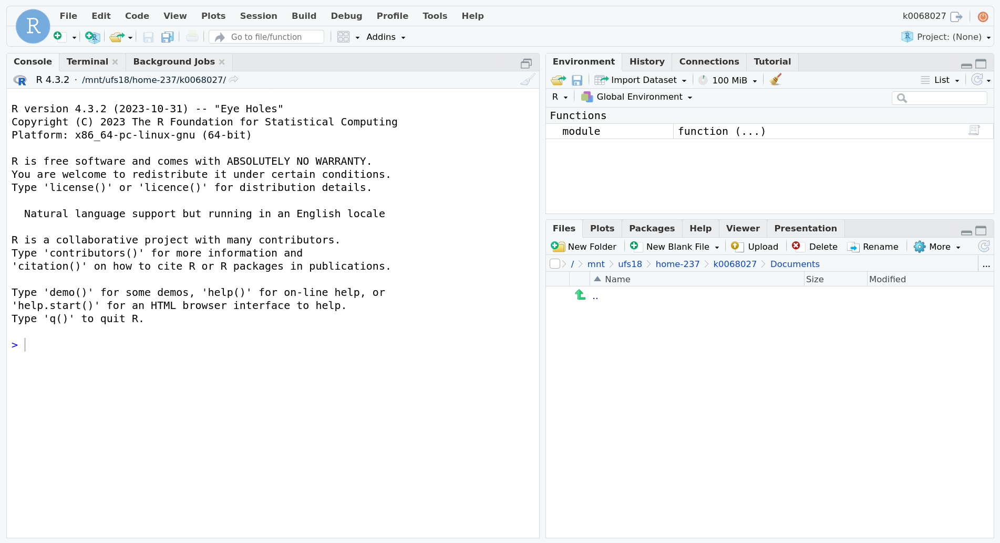
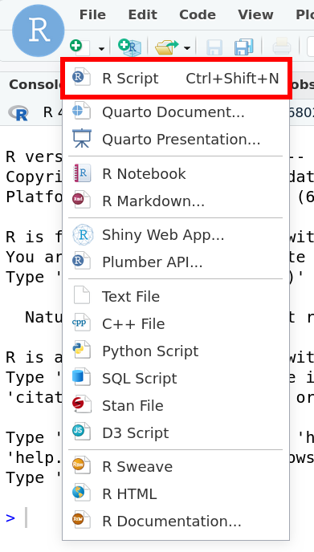
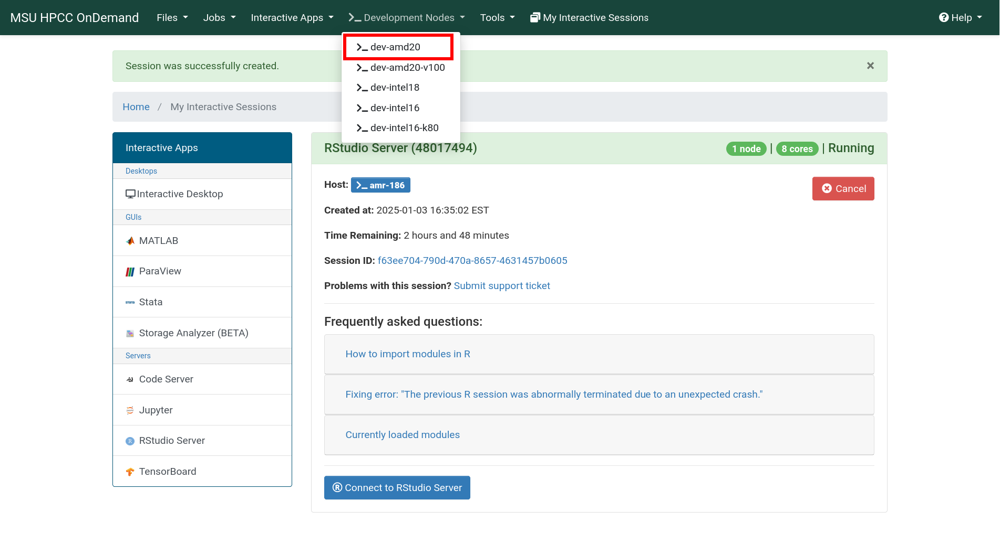

:::::::::::::::::::::::::::::::::::::: questions 

- How can you run RStudio on the HPCC?

::::::::::::::::::::::::::::::::::::::::::::::::

::::::::::::::::::::::::::::::::::::: objectives

- Create an OnDemand session to run RStudio Server
- Understand the options for creating an OnDemand session
- Access a terminal on the node where your RStudio job is running

::::::::::::::::::::::::::::::::::::::::::::::::

## OnDemand

HPCC resources have traditionally been accessed solely through a terminal.
Though the terminal is still the best way to accomplish many tasks on the HPCC,
launching graphical user interfaces (GUIs) like RStudio is not one of them! This
procedure has been streamlined through the use of OnDemand to run graphical
applications through your web browser.

This is where we will start our journey with R on the HPCC, eventually making
our way back to using R on the command line.

## Starting an RStudio job

We'll begin by logging in on OnDemand. Go to
[https://ondemand.hpcc.msu.edu](https://ondemand.hpcc.msu.edu). If you are
prompted, choose Michigan State University as the Identity Provider, and log in
using your MSU NetID and password. Before we get into any other OnDemand
specifics, we'll submit an RStudio job to get you up and running.

Go to the Interactive Apps tab and select RStudio Server (beta).

{alt='The OnDemand home screen with the Interactive Apps tab expanded to show RStudio Server'}

:::::::::::::::::::::: callout

## RStudio Server vs RStudio

In ICER's OnDemand interface, we use RStudio Server instead of just RStudio.
This is a version of RStudio that runs on compute nodes and opens in your
browser. Though it is possible to run plain RStudio on the HPCC, the Server
version is as it displays more clearly and is easier to copy and paste into.

For the rest of this page, when we refer to "RStudio", we really mean "RStudio
Server".

::::::::::::::::::::::::::::::

On the following screen you will be able to choose the options for your RStudio
job. For this workshop, you should use the following options:

- R version: 4.3.2 (with additional CRAN packages, RECOMMENDED)
- Number of hours: 3
- Number of cores per task: 8
- Amount of memory: 5GB

{alt='The RStudio OnDemand setup screen with text boxes for the four options listed above filled in using the values specified.'}

If you need to specify any other options (for example, if you want to run your
session on a buy-in node and specify your SLURM account), you can click the
Advanced Options checkbox and enter additional information.

Select the Launch button and wait for your job to start. When your job is ready,
you will see a card with all of the information for your job. The most important
fields for now are the Host which is the node on the HPCC where you job is
running and the Time Remaining which counts down from the requested number of
hours.

{alt="An OnDemand card with the information for a running RStudio job. The Host is amr-186, and the Time Remaining is 2 hours and 59 minutes."}

When you're ready to access RStudio, you can click the Launch RStudio Server
button. If you ever navigate away from this screen, you can always return to it
by clicking the My Interactive Sessions button in the OnDemand navigation bar.
On narrower screens, this button shrinks down to a graphic of a pair of
overlapping cards next to the Tools dropdown.

## RStudio

After Launching your RStudio session, a new tab in your browser will show an
RStudio interface.

{alt="An RStudio Server session. An R console takes up the left half of RStudio, and the right half is split between an environment section on top and a file browser on bottom."}

On startup, there are three main sections to RStudio: an R console, an
environment section, and a file browser. Notice that the file browser starts in
your HPCC home directory.

::::::::::::::::::::::::::::::::::::: challenge 

## Open a file

Use the RStudio interface to create a new R Script file.

:::::::::::::::::::::::: solution 

Click the button that looks like a page with a plus sign right below the file menu and choose R Script.

{alt="The new document button in RStudio expanded to show options like 'R Script' and 'R Markdown'. The 'R Script' button is highlighted."}

Notice that the R console shrinks to make room for the text editor.

:::::::::::::::::::::::::::::::::


::::::::::::::::::::::::::::::::::::::::::::::::

## Connect to your RStudio node from the command line

As discussed earlier, OnDemand tells you the Host that your RStudio job is
running on. From time to time, you may need to run commands on this host from a
command line. You have two options.

### The RStudio terminal

Handily, RStudio provides a terminal for you to use! Right next to the R
console, is a Terminal tab. Clicking this tab will start a terminal on the same
node that RStudio is running on.

{alt="The terminal tab in RStudio showing a terminal connected to the host amr-186."}


### SSH

This can be accomplished through any terminal that you can SSH to the HPCC on.
Since we're already using OnDemand, we'll use the built-in terminal.

Returning to the OnDemand window, open the Development Nodes dropdown from the
navigation bar.

{alt="The Development Nodes dropdown from the OnDemand navigation bar showing the development nodes accessible on the HPCC. The dev-amd20 options is highlighted."}

Choose any development node, and a new tab will open with a terminal on that
node.

:::::::::::::::::::::::::: callout

## SSH outside of OnDemand

If you are not using an OnDemand terminal, you first need to manually SSH into a
development node. From your terminal (e.g., the built in terminal on Mac or
MobaXterm on Windows), SSH into the gateway via `ssh <netid>@hpcc.msu.edu`, then
SSH into a development node, e.g., `ssh dev-amd20`.

::::::::::::::::::::::::::::::::::

Now find the Host your RStudio session is running on (remember, this information is always available in the My Interactive Jobs section in OnDemand), and in the development node terminal type 

```bash
ssh <host>
```

replacing `<host>` by the host your RStudio session is running on.

::::::::::::::::::::::::::::::::::: challenge

Run the `top` command via command line on the node your RStudio session is running on and verify that indeed R is running there.

*Hint*: If your node is busy, you can use `top -u <netid>` (replacing `<netid>` with your username) to see just your running processes.

::::::::::::::::::::::::::: solution

Running `top -u k0068027` (my username) from the RStudio terminal shows the
`rsession` command in the `COMMAND` column representing the R session where we
can execute code. Scrolling through the entries, `rserver` (i.e., RStudio
Server) also appears.

{alt="The top command running through the RStudio terminal. In addition to some auxiliary processes, one row in the top output has 'rsession' in the COMMAND column."}

Depending on your screen width, you may have to use the arrow keys to scroll to
the right and see the `COMMAND` column.

::::::::::::::::::::::::::::::::::::

:::::::::::::::::::::::::::::::::::::::::::::

::::::::::::::::::::::::::::::::::::: keypoints 

- Start an RStudio Server session from [OnDemand](https://ondemand.hpcc.msu.edu)
- Access the command line of the node your process is running on through the RStudio terminal or SSH into the host OnDemand provides you.

::::::::::::::::::::::::::::::::::::::::::::::::

